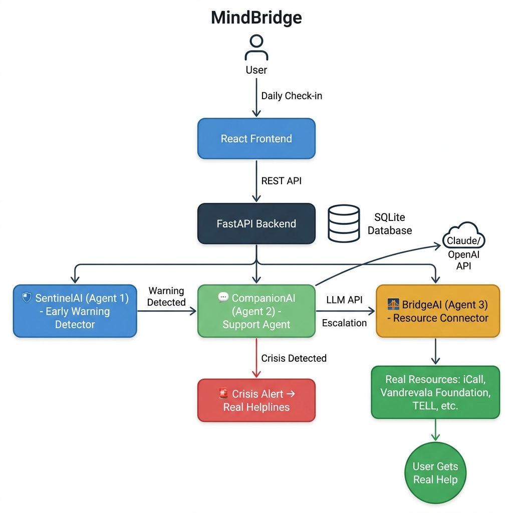

<div align="center">

# 🧠 MindBridge

### *"Not a chatbot. A system that acts."*

**An Agentic AI Mental Health Support System**

[](https://faraway2026.com)
[](https://python.org)
[](https://reactjs.org)
[](https://fastapi.tiangolo.com)

</div>

---

## 📋 Problem Statement

> **1 billion+ people worldwide are affected by mental health disorders** (WHO, 2025)

- **91%** of depression patients receive **zero treatment**
- Only **13 mental health workers per 100,000 people** globally
- Therapists are **expensive**, have long waiting lists, and are **city-only**
- Existing chatbots (Wysa, Woebot) are **reactive** — they wait for you to reach out
- Helplines only work **after** crisis, not **before**
- **No system proactively monitors AND acts**

Mental health is not a privilege. With MindBridge, it doesn't have to be.

---

## 💡 Solution Overview

MindBridge is an **agentic AI system** with **3 autonomous agents** that work together. It **DETECTS** warning signs early, **SUPPORTS** the user in their own language, and **CONNECTS** them to real resources — all autonomously, without human operators.

### The 3 Agents

| Agent | Name | Role | Behavior |
|-------|------|------|----------|
| 🛡️ Agent 1 | **SentinelAI** | Early Warning Detector | Monitors daily patterns, detects mental health deterioration before crisis |
| 💬 Agent 2 | **CompanionAI** | Personalized Support | CBT-based conversations, adapts to language and culture |
| 🌉 Agent 3 | **BridgeAI** | Resource Connector | Connects users to real-world therapists, helplines, and support |

### What Makes This "Agentic"?

- **Agent 1** runs autonomously on every check-in and makes independent risk assessments
- **Agent 2** activates automatically when Agent 1 flags risk — no human trigger needed
- **Agent 3** activates automatically when Agent 2 detects escalation need
- **No human operator** is needed between steps
- Each agent has its **own decision logic** and acts **independently**

---

## 🏗️ Architecture



```
[User] → Daily Check-in → [React Frontend]
                                ↓ REST API
                          [FastAPI Backend] ←→ [SQLite DB]
                                ↓
                    ┌───────────┼───────────┐
                    ↓           ↓           ↓
            [🛡️ SentinelAI] → [💬 CompanionAI] → [🌉 BridgeAI]
             Agent 1          Agent 2 ←→ LLM    Agent 3
             Detect           Support           Connect
                                ↓                  ↓
                          [🚨 Crisis?         [Real Resources:
                           → Helplines]        iCall, Vandrevala,
                                               TELL, 7 Cups...]
                                                   ↓
                                            [User Gets Real Help]
```

---

## 🔧 Tech Stack

| Layer | Technology |
|-------|-----------|
| **Frontend** | React 18 (Vite), Tailwind CSS v4, Recharts, React Router, Axios, Lucide Icons |
| **Backend** | Python 3.11+, FastAPI, SQLAlchemy, Pydantic |
| **Database** | SQLite |
| **AI/LLM** | Anthropic Claude API / OpenAI GPT (fallback) |
| **Auth** | JWT (PyJWT) + bcrypt password hashing |
| **Dev Tools** | python-dotenv, uvicorn, CORS middleware |

---

## 🚀 Setup Instructions

### Prerequisites
- Python 3.11+
- Node.js 18+
- An Anthropic or OpenAI API key (for CompanionAI chat)

### 1. Clone the Repository

```bash
git clone https://github.com/your-username/mindbridge.git
cd mindbridge
```

### 2. Backend Setup

```bash
cd backend

# Create virtual environment
python -m venv venv

# Activate virtual environment
# Windows:
venv\Scripts\activate
# Mac/Linux:
source venv/bin/activate

# Install dependencies
pip install -r requirements.txt

# Configure environment
cd ..
copy .env.example .env
# Edit .env and add your API keys

# Start the backend server
cd backend
uvicorn main:app --reload --port 8000
```

The API will be available at `http://localhost:8000`
API docs at `http://localhost:8000/docs`

### 3. Frontend Setup

```bash
cd frontend

# Install dependencies
npm install

# Start the development server
npm run dev
```

The frontend will be available at `http://localhost:5173`

### 4. Environment Variables

Copy `.env.example` to `.env` and fill in:

```env
ANTHROPIC_API_KEY=your-key-here    # Required for CompanionAI
OPENAI_API_KEY=your-key-here       # Fallback if no Anthropic key
JWT_SECRET=your-secret-key         # Change in production
```

---

## 📡 API Endpoints

### Authentication
| Method | Endpoint | Description |
|--------|----------|-------------|
| POST | `/api/auth/signup` | Register new user |
| POST | `/api/auth/login` | Login, returns JWT token |
| GET | `/api/auth/me` | Get current user profile |

### Check-in (Agent 1: SentinelAI)
| Method | Endpoint | Description |
|--------|----------|-------------|
| POST | `/api/checkin/` | Submit daily mood check-in |
| GET | `/api/checkin/trends/{user_id}` | Get trend data for charts |
| GET | `/api/checkin/today` | Check if user submitted today |

### Chat (Agent 2: CompanionAI)
| Method | Endpoint | Description |
|--------|----------|-------------|
| POST | `/api/chat/` | Send message, get AI response |
| GET | `/api/chat/history/{session_id}` | Get conversation history |
| POST | `/api/chat/start` | Start new chat session |

### Resources (Agent 3: BridgeAI)
| Method | Endpoint | Description |
|--------|----------|-------------|
| GET | `/api/resources/` | Filter resources by country/language/cost |
| GET | `/api/resources/recommendations/{user_id}` | Get personalized recommendations |

---

## 🔒 Safety & Ethics

### What We Always Do
- ✅ Redirect crisis situations to **real human helplines immediately**
- ✅ Make helpline numbers **always visible** in the app
- ✅ Log crisis events for safety
- ✅ Clearly state this is **not a replacement for professional therapy**
- ✅ Require **explicit user permission** before contacting anyone

### What We Never Do
- ❌ Never provide medical diagnosis
- ❌ Never handle suicide/self-harm crisis with AI — always redirect to humans
- ❌ Never store sensitive data without encryption
- ❌ Never share user data with third parties
- ❌ Never auto-notify family without explicit permission
- ❌ Never claim to replace a therapist

### Crisis Keywords → Immediate Helpline
If any crisis keyword is detected (in English or Hindi), the AI conversation **stops immediately** and shows helpline numbers:

- 🇮🇳 **India**: iCall — 9152987821 | Vandrevala Foundation — 1860-2662-345
- 🇯🇵 **Japan**: TELL — 03-5774-0992 | Inochi no Denwa — 0120-783-556
- 🌍 **International**: Befrienders Worldwide — befrienders.org

---

## 👥 User Flow

1. **Sign Up / Login** → Create account with country & language
2. **Daily Check-in** → 2-minute form: mood, sleep, social, energy, journal
3. **Dashboard** → View weekly/monthly trend charts
4. **Warning Detection** → SentinelAI autonomously detects declining patterns
5. **Supportive Chat** → CompanionAI activates with CBT-based conversation
6. **Real Resources** → BridgeAI connects to therapists, helplines, support groups
7. **Get Real Help** → User reaches professional human support

---

## 🏆 Demo Script (90 seconds)

| Time | Scene | What Happens |
|------|-------|-------------|
| 0-20s | **Declining Patterns** | Show 5-day check-in history with mood: 7→6→5→4→3 |
| 20-40s | **Agent 1 Detects** | SentinelAI triggers warning, notification appears |
| 40-70s | **Agent 2 Supports** | CompanionAI CBT conversation, empathetic responses |
| 70-90s | **Agent 3 Connects** | BridgeAI shows real resources, user saves a contact |

---

## 👤 Team

| Name | Role |
|------|------|
| [Your Name] | Full-Stack Developer & AI Engineer |
| [Team Member 2] | [Role] |
| [Team Member 3] | [Role] |

---

## 📜 License

This project is built for **FAR AWAY 2026** — India's biggest international hackathon.

---

<div align="center">

*"Mental health is not a privilege. With MindBridge, it doesn't have to be."*

**Built with ❤️ for FAR AWAY 2026 🌏**

</div>
